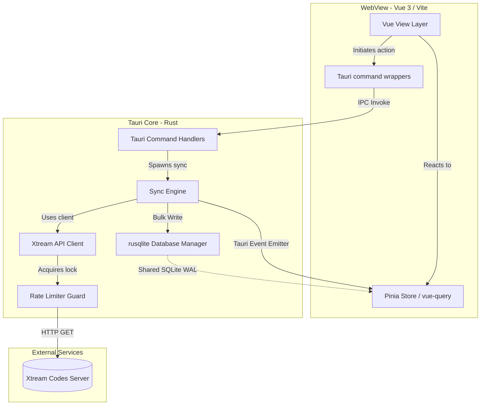
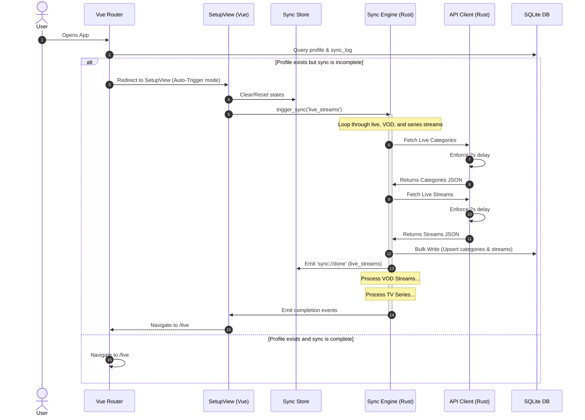

# System Architecture & Data Flow

This document details the high-level system components, communication flows, and data synchronization patterns of the IPTV Helper application.

## High-Level System Architecture

IPTV Helper is built on Tauri, splitting the codebase into a frontend User Interface (running in a system webview) and a backend Core process (written in Rust).

---

## Component Descriptions

### 1. Frontend Layer
* **Vue 3 Views & Components**: Manages rendering and visual states. 
* **Pinia Sync Store**: Stores state indicators (e.g. syncing, success timestamps, counts, errors) for live tracking.
* **Tauri Command Wrappers (`src/lib/tauri-commands.ts`)**: Center of type-safe IPC calls. The UI calls these wrappers instead of invoking commands directly.
* **useSync Composable (`src/composables/useSync.ts`)**: Listens to global Tauri events (`sync://started`, `sync://progress`, `sync://done`, `sync://error`) emitted by the backend to coordinate frontend transitions.

### 2. Backend Layer
* **Tauri Command Handlers (`src-tauri/src/commands/`)**: Receives calls from the frontend, maps input variables, and calls core libraries.
* **Sync Engine (`src-tauri/src/sync/engine.rs`)**: Controls sequential caching of TV elements (`live_streams` $\rightarrow$ `vod_streams` $\rightarrow$ `series`). It handles SQLite connections and writes.
* **Xtream Client (`src-tauri/src/api/client.rs`)**: Orchestrates calls to the server. Includes robust deserializers (`deserialize_option_string`, `deserialize_option_i32`) to coerce conflicting server datatypes (e.g., `"tv_archive": "1"` vs `1`).
* **Rate Limiter**: Tracks a thread-safe `last_request_time: Mutex<Option<Instant>>`. Ensures that no requests fire within 2 seconds of each other, preventing client bans.

---

## Data Sync & Auto-Recovery Flow

The application implements a resilient sequential sync flow that recovers automatically if interrupted or failed.

### Resiliency & Auto-Recovery Behaviors:
1. **Routing Guard**: The router checks the database's `sync_log`. If the app was closed mid-sync, or a step failed on the last run, the app forces routing back to `/setup`.
2. **Auto-Resume**: When `/setup` mounts under these conditions, it automatically sets `isSyncing = true`, loads successful states, and resumes the sync.
3. **Log Diagnostics**: If the server returns bad formats, the backend reads the body as text, saves the exact output to `~/.local/share/com.iptv.helper/failed_<action>.txt`, and throws a descriptive error so you can see exactly what went wrong.
