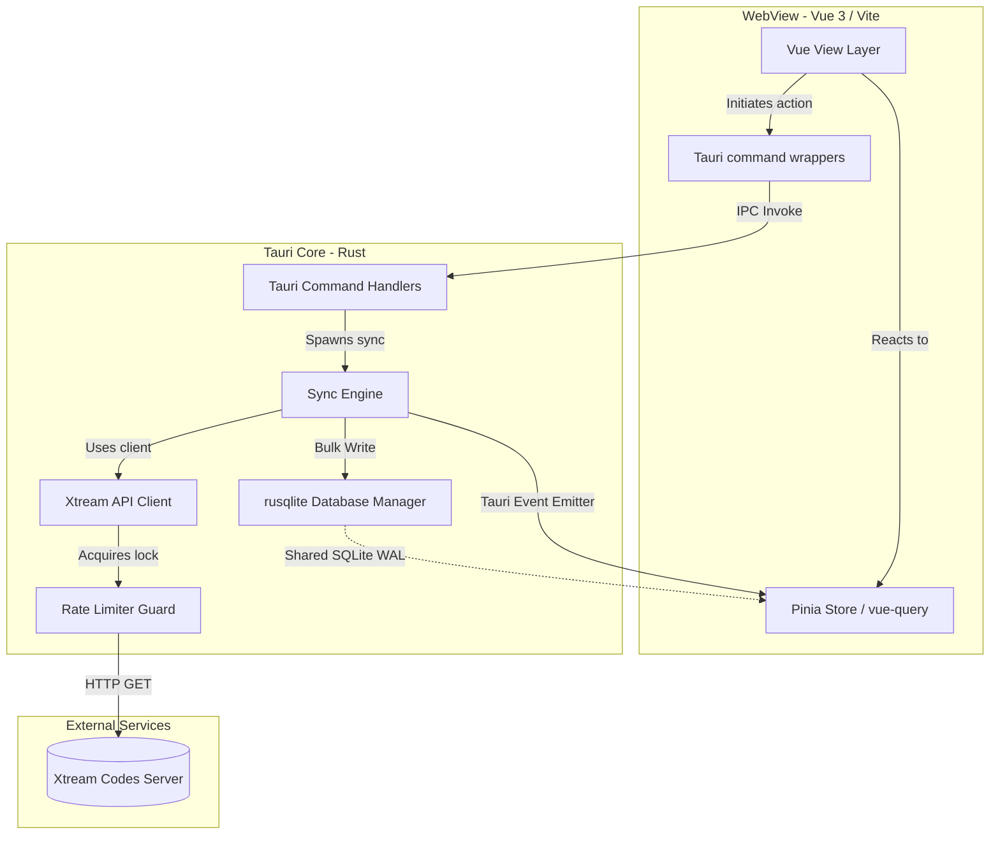
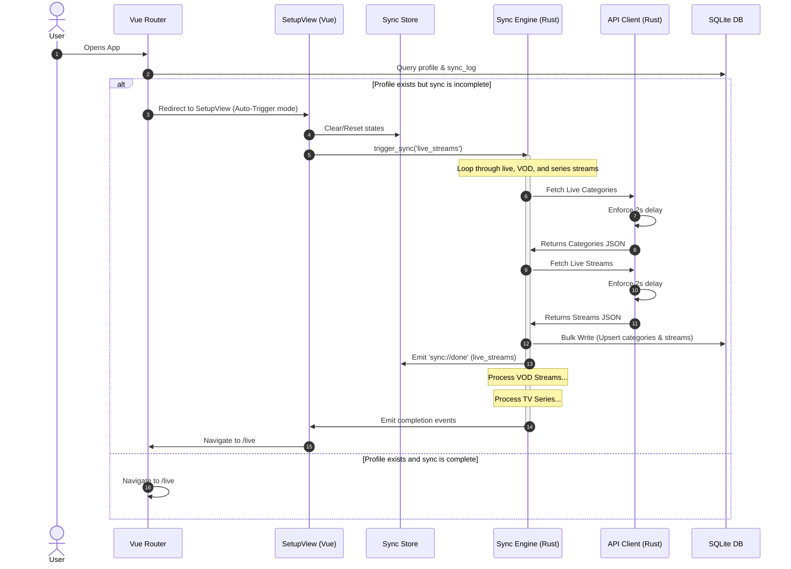

# System Architecture & Data Flow

This document details the high-level system components, communication flows, and data synchronization patterns of the IPTV Helper application.

## High-Level System Architecture

IPTV Helper is built on Tauri, splitting the codebase into a frontend User Interface (running in a system webview) and a backend Core process (written in Rust).

---

## Component Descriptions

### 1. Frontend Layer
* **Vue 3 Views & Components**: Manages rendering and visual states. Implements clean, reusable layout structures (e.g. [StreamDetailPanel.vue](file:///home/martin/dev/iptv-helper/src/components/ui/StreamDetailPanel.vue) to consolidate the details panel and drawer, and [CategorySidebar.vue](file:///home/martin/dev/iptv-helper/src/components/ui/CategorySidebar.vue) for responsive layouts).
* **Pinia Sync Store**: Stores state indicators (e.g. syncing, success timestamps, counts, errors) for live tracking.
* **Pinia Toast Store (`src/stores/toast.store.ts`)**: Manages global toast state and notifications, paired with the root-mounted [AppToast.vue](file:///home/martin/dev/iptv-helper/src/components/ui/AppToast.vue) component.
* **Tauri Command Wrappers (`src/lib/tauri-commands.ts`)**: Center of type-safe IPC calls. The UI calls these wrappers instead of invoking commands directly.
* **useSync Composable (`src/composables/useSync.ts`)**: Listens to global Tauri events (`sync://started`, `sync://progress`, `sync://done`, `sync://error`) emitted by the backend to coordinate frontend transitions.
* **Lazy Image Loader ([CachedImage.vue](file:///home/martin/dev/iptv-helper/src/components/ui/CachedImage.vue))**: Uses a browser `IntersectionObserver` to defer fetching logo and poster images from the backend/database until they enter the viewport. Properly handles cleanup and object URL revocation on unmount to prevent leaks.
* **Virtualized Movie Grid ([MovieList.vue](file:///home/martin/dev/iptv-helper/src/components/movies/MovieList.vue))**: Calculates column count and row metrics dynamically via `ResizeObserver` to virtually render large collections of movies smoothly.

### 2. Backend Layer
* **Tauri Command Handlers (`src-tauri/src/commands/`)**: Receives calls from the frontend, maps input variables, and routes commands (e.g., VOD queries, EPG, or player actions).
* **Sync Engine (`src-tauri/src/sync/engine.rs`)**: Controls sequential caching of TV elements (`live_streams` $\rightarrow$ `vod_streams` $\rightarrow$ `series`). It handles SQLite connections and writes.
* **Xtream Client (`src-tauri/src/api/client.rs`)**: Orchestrates calls to the server. Includes robust deserializers (`deserialize_option_string`, `deserialize_option_i32`) to coerce conflicting server datatypes (e.g., `"tv_archive": "1"` vs `1`).
* **Unified Category Modules**: Utilizes [CategoryApi](file:///home/martin/dev/iptv-helper/src-tauri/src/api/common.rs) and the generic [query_categories_generic](file:///home/martin/dev/iptv-helper/src-tauri/src/db/common.rs) function to unify categories mapping and database queries for Live and VOD.
* **On-Demand VOD Caching**: Backend command handler `get_vod_info` manages a local SQLite cache check in the `vod_info` table, fallback to API query, and subsequent database writes.
* **System Clipboard Integration**: Due to frontend sandbox limitations, copy-to-clipboard operations are delegated to Rust commands on the backend to copy URLs and EPG information reliably.
* **Rate Limiter**: Tracks a thread-safe `last_request_time: Mutex<Option<Instant>>`. Ensures that no requests fire within 2 seconds of each other, preventing client bans.

---

## Data Sync & Auto-Recovery Flow

The application implements a resilient sequential sync flow that recovers automatically if interrupted or failed.

### Resiliency & Auto-Recovery Behaviors:
1. **Routing Guard**: The router checks the database's `sync_log`. If the app was closed mid-sync, or a step failed on the last run, the app forces routing back to `/setup`.
2. **Auto-Resume**: When `/setup` mounts under these conditions, it automatically sets `isSyncing = true`, loads successful states, and resumes the sync.
3. **Log Diagnostics**: If the server returns bad formats, the backend reads the body as text, saves the exact output to `~/.local/share/com.iptv.helper/failed_<action>.txt`, and throws a descriptive error so you can see exactly what went wrong.

---

## Technical Details of Recent Implementations

### 1. Lazy Image Loading & BLOB Cache
To avoid overwhelming the application memory and disk channels during rapid scrolling of thousands of channels or movies:
- Logo and poster images render via `CachedImage.vue`.
- An `IntersectionObserver` with a `200px` root margin detects when the card is close to the viewport.
- Only then is the target URL requested. The backend fetches the image, stores it in the `image_cache` BLOB table, and returns a binary stream.
- The frontend loads this into a local Object URL (`blob:http...`). When the component unmounts, the observer disconnects and the Object URL is explicitly revoked to free up memory.

### 2. On-Demand VOD Caching Flow
Rather than pre-syncing heavy, detailed metadata (such as cast, synopsis, plot, and background covers) for all movies in a playlist (which could be tens of thousands of items):
1. The frontend invokes `get_vod_info` when opening a movie detail drawer.
2. The Tauri Core intercepts the call and checks `vod_info` SQLite table.
3. **Cache Hit**: Instantly returns cached JSON data.
4. **Cache Miss**: Authenticates via keyring-stored credentials, queries the Xtream API, caches the results back to `vod_info` for future hits, and returns the data.

### 3. Desktop/Mobile UI Simplification
Large view components have been broken down:
- Standardized filter heads ([FilterHeader.vue](file:///home/martin/dev/iptv-helper/src/components/ui/FilterHeader.vue)) consolidate search criteria and layout settings.
- Sorted selects ([CustomSelect.vue](file:///home/martin/dev/iptv-helper/src/components/ui/CustomSelect.vue)) provide custom styled, clickable drop-down fields.
- Drawer layouts ([StreamDetailPanel.vue](file:///home/martin/dev/iptv-helper/src/components/ui/StreamDetailPanel.vue)) combine desktop side panels and mobile bottom sheets into a unified slot-based API.
