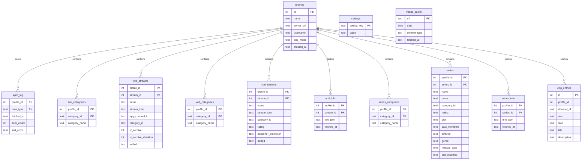

# Database Architecture

This document describes the storage layer of the IPTV Helper application. The application utilizes SQLite as its local data cache.

## Design Philosophy & WAL Mode
To ensure responsiveness and avoid deadlocks, the application implements a strict **single-writer, multiple-readers** boundary between Rust and the Frontend:
1. **Rust-side Writes**: Rust holds a single connection wrapped in a standard library `Mutex<rusqlite::Connection>` inside the Tauri state manager. This connection is used exclusively for executing migrations, inserting/updating profile info, writing bulk sync caches, and updating sync logs.
2. **Frontend-side Reads**: The web frontend uses `tauri-plugin-sql` to spawn its own internal connection pool to read directly from the same database file.
3. **WAL (Write-Ahead Logging)**: SQLite is initialized with `PRAGMA journal_mode = WAL`. This allows frontend read queries to run concurrently with bulk Rust database writes without blocking each other.

---

## Entity Relationship Diagram (ERD)



---

## Schema Reference

### `profiles`
Holds general configuration details for the connected server. Currently, the application supports a single active profile (ID `1`).
* **`id`** (`INTEGER PRIMARY KEY`): Unique profile identifier.
* **`name`** (`TEXT`): Visual label for this connection profile.
* **`server_url`** (`TEXT`): Server host URL (e.g. `http://example.com:8080`).
* **`username`** (`TEXT`): Server login username.
* **`epg_mode`** (`TEXT`): EPG parser source selection (defaults to `xmltv`).
* **`created_at`** (`TEXT`): Timestamp (ISO 8601) of profile creation.

*Note: The password is saved separately under the `settings` table for database writes or fetched dynamically.*

### `settings`
Key-value store representing general application settings (e.g., player executable paths, selected theme, override formats).
* **`key`** (`TEXT PRIMARY KEY`): Setting identifier (e.g., `theme`, `password`, `server_url`).
* **`value`** (`TEXT`): String representation of the setting's configuration.

### `sync_log`
Tracks the history and state of background sync activities. 
* **`profile_id`** (`INTEGER`): Reference to the profile.
* **`data_type`** (`TEXT`): Sync data identifier (`live_streams`, `vod_streams`, `series`, or `epg`).
* **`fetched_at`** (`TEXT`): Timestamp of the last sync attempt.
* **`item_count`** (`INTEGER`): Total number of items stored during the last successful sync.
* **`last_error`** (`TEXT`): Records the failure details of the last run. If this is present, the sync is marked stale and will retry.

### `live_streams` & `live_categories`
Stores the listings of live channels.
* `live_streams` contains a category index (`idx_live_category`) and an EPG mapping index (`idx_live_epg`) for rapid searching.
* `tv_archive` indicates whether the channel supports replay buffers.

### `vod_streams`, `vod_categories`, & `vod_info`
Stores VOD movies. `vod_info` holds the lazy-loaded metadata JSON payload (e.g., description, director, actors) returned by the Xtream API when the user requests detail pages.

### `series`, `series_categories`, & `series_info`
Stores TV series and seasons. `series_info` caches seasons and episode JSON arrays associated with a series profile.

### `epg_entries`
Stores electronic program guide listings parsed from external sources. Starts and stops are stored in UTC ISO 8601 formats, indexed for rapid channel EPG listings.

### `image_cache`
Stores cached images (e.g. logos and posters) downloaded from external stream URLs. Storing images locally as binary BLOBs allows the application to serve images instantly and work offline.
* **`url`** (`TEXT PRIMARY KEY`): The source image URL.
* **`data`** (`BLOB`): Raw binary image bytes.
* **`content_type`** (`TEXT`): HTTP `Content-Type` header (MIME type) detected when downloaded (e.g. `image/png`).
* **`fetched_at`** (`TEXT`): ISO 8601 timestamp of when the image was fetched and cached.

---

## Database Inspector Script

The project provides a utility script [inspect_db.py](file:///home/martin/dev/iptv-helper/scripts/inspect_db.py) to inspect the local database status, query row counts, and check the performance of the image cache.

### Features
- Reports the database file size on disk.
- Summarizes the active configuration profiles.
- Outputs sync logs, including success/failure history.
- Performs cache analysis (counting total URLs, unique image blobs, and duplicate blobs to detect duplicate image storage on different urls).
- Prints row counts for all major tables.

### Usage
Run the script using python3:
```bash
python3 scripts/inspect_db.py
```
